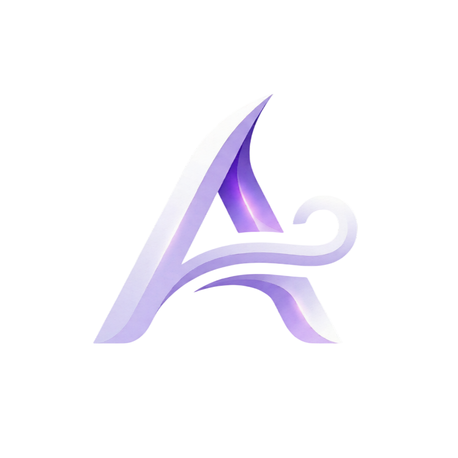
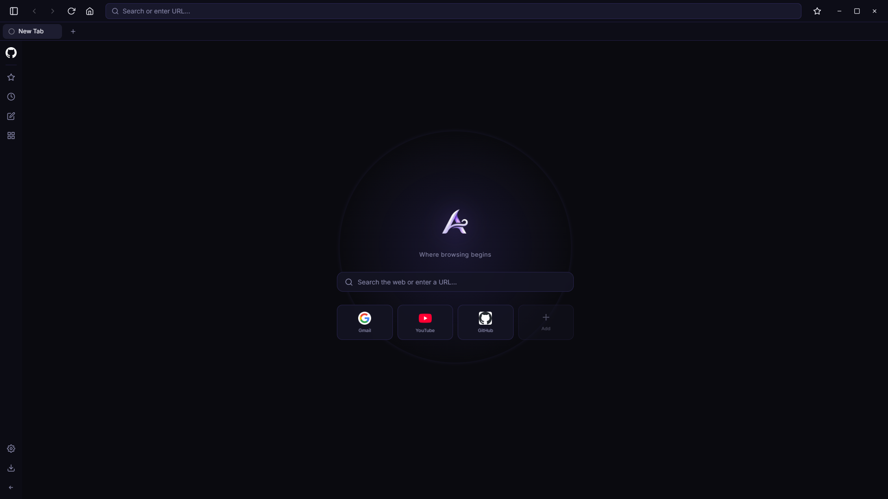

<p align="center">
  
</p>

<h1 align="center">Aether Browser</h1>

<p align="center">
  <strong>A modern, themeable desktop browser built from the ground up.</strong><br/>
  Custom browser shell · Glassmorphism UI · Built with Electron, React & Bun
</p>

<p align="center">
  
  
  
  
  
</p>

<p align="center">
  <a href="README.md"><strong>Readme</strong></a> ·
  <a href="UPCOMING.md"><strong>Upcoming Features</strong></a>
</p>

<p align="center">
  
</p>

---

## Overview

Aether is a **custom-engineered desktop web browser** — not a reskin, not a wrapper.  
While it leverages the Chromium engine (via Electron) for standards-compliant web rendering, the entire browser shell is built from scratch: the tab system, navigation bar, sidebar, settings, password manager, download manager, and every pixel of the UI.

> Think of it like building a car: Chromium is the engine block under the hood, but the frame, dashboard, controls, and design are all custom.

---

## ✨ Features

### Core Browser
- **Tabbed Browsing** — Full tab management with open, close, reorder, and keyboard shortcuts (`Ctrl+T`, `Ctrl+W`, `Ctrl+Tab`, etc.)
- **Smart Omnibox** — Intelligent URL bar with auto-detection: enter a URL to navigate, or type anything else to Google it
- **Full Navigation** — Back, Forward, Reload, Hard Reload, Home
- **Context Menus** — Right-click menus with Open Link in New Tab, Copy, Search Google, Inspect Element, and more
- **Zoom Controls** — `Ctrl+=` / `Ctrl+-` / `Ctrl+0` for zoom in, out, and reset
- **Fullscreen** — `F11` to toggle fullscreen
- **Permission Handling** — Controlled permission prompts for media, geolocation, notifications, and clipboard

### Sidebar
A collapsible glassmorphism sidebar with an icon rail and expandable panels:

| Panel | Description |
|---|---|
| ⭐ **Bookmarks** | Save, manage, and quickly navigate to your favorite pages |
| 🕐 **History** | Browse and search your recent navigation history |
| 📝 **Quick Note** | Auto-saved scratchpad — persists across sessions |
| 📌 **Essentials** | Pin up to 5 sites to the sidebar rail for one-click access |
| ⬇️ **Downloads** | Real-time download manager with pause, resume, and cancel |

### Settings
A full settings page with categorized sections:

- **General** — Theme switching, search engine info, download preferences, data management
- **Passwords** — Built-in password manager (add, edit, delete saved credentials)
- **About** — Version info, engine details, license
- **Developer** — Hidden developer options (toggle by clicking the logo 10× on the About page)

### Themes
Three built-in themes with real-time switching via CSS variables:

| Theme | Description |
|---|---|
| ☀️ **Aether Light** | Clean and bright with purple accents |
| 🌙 **Deep Night** | Dark and immersive with indigo glow |
| 💜 **Cyberpunk Purple** | Ultra-dark with neon magenta highlights |

Themes persist across sessions via `localStorage`.

### New Tab Page
- Customizable shortcut grid (add, edit, remove, and reorder)
- Integrated search bar with URL detection
- Beautiful logo branding with ambient glow

---

## ⌨️ Keyboard Shortcuts

All standard browser shortcuts are intercepted at the Electron level and forwarded to the React UI — they work even when a webview has focus.

| Shortcut | Action |
|---|---|
| `Ctrl + T` | New tab |
| `Ctrl + W` | Close tab |
| `Ctrl + Shift + T` | Reopen closed tab |
| `Ctrl + Tab` | Next tab |
| `Ctrl + Shift + Tab` | Previous tab |
| `Ctrl + 1-9` | Switch to tab N |
| `Ctrl + L` / `F6` | Focus URL bar |
| `Ctrl + R` / `F5` | Reload |
| `Ctrl + Shift + R` | Hard reload |
| `Ctrl + D` | Toggle bookmark |
| `Ctrl + B` | Toggle sidebar |
| `Ctrl + H` | Open history |
| `Ctrl + Shift + I` | Webview DevTools |
| `Ctrl + Shift + J` | Host DevTools |
| `Alt + ←` / `→` | Back / Forward |
| `F11` | Fullscreen |
| `Ctrl + =` / `-` / `0` | Zoom in / out / reset |

---

## 🚀 Getting Started

### Prerequisites

- [Bun](https://bun.sh/) v1.0+
- [Node.js](https://nodejs.org/) (for Electron)

### Install

```bash
bun install
```

### Development

```bash
bun run dev
```

This will:
1. Build the React renderer via Webpack
2. Compile the Electron main process (TypeScript)
3. Launch the Aether Browser window

### Production Build

```bash
bun run build
```

---

## 📁 Project Structure

```
aether-browser/
├── src/
│   ├── main/
│   │   ├── main.ts                 # Electron main process, IPC handlers, download manager
│   │   └── preload.ts              # Secure IPC bridge (context isolation)
│   └── renderer/
│       ├── index.html              # HTML shell
│       ├── index.tsx               # React entry point
│       ├── assets.d.ts             # TypeScript declarations for image imports
│       ├── App.tsx                  # Core app — tab management, navigation, UI orchestration
│       ├── logo-app.png            # App icon
│       ├── logo-comp-transparent.png # Logo (transparent, used in new tab & about)
│       ├── components/
│       │   ├── Sidebar.tsx          # Collapsible sidebar with icon rail & panels
│       │   ├── NewTab.tsx           # New tab page with search & customizable shortcuts
│       │   ├── Settings.tsx         # Full settings page (themes, passwords, data, dev mode)
│       │   ├── Downloads.tsx        # Downloads popover component
│       │   ├── DownloadsPage.tsx    # Full-page downloads view
│       │   └── PasswordManager.tsx  # Password manager UI
│       ├── stores/
│       │   ├── themeStore.ts        # Zustand store for theme management
│       │   └── essentialsStore.ts   # Zustand store for pinned essential sites
│       └── styles/
│           └── index.css            # Global styles, themes & glassmorphism effects
├── package.json
├── tsconfig.json
├── tsconfig.main.json
├── webpack.config.js
├── tailwind.config.js
└── postcss.config.js
```

---

## 🛠️ Tech Stack

| Layer | Technology |
|---|---|
| **Runtime** | [Bun](https://bun.sh/) |
| **Framework** | [Electron](https://www.electronjs.org/) |
| **UI** | [React 18](https://react.dev/) + [Tailwind CSS 3](https://tailwindcss.com/) |
| **State** | [Zustand](https://zustand-demo.pmnd.rs/) |
| **Bundler** | [Webpack 5](https://webpack.js.org/) |
| **Language** | TypeScript |

---

## 🏗️ Architecture

Aether is a **custom browser shell** built on top of Chromium (via Electron).

- **Chromium (Blink + V8)** handles HTML/CSS rendering and JavaScript execution for web pages — the same engine used by Chrome, Edge, Brave, Arc, Opera, and Vivaldi.
- **Everything else is custom-built:** the entire UI, tab management system, keyboard shortcut interceptor, IPC security bridge, context menus, download manager, password storage, history, bookmarks, and settings.

```
┌─────────────────────────────────────────────────┐
│                  Aether Browser                 │
│  ┌───────────────────────────────────────────┐  │
│  │         Custom Browser Shell (React)      │  │
│  │  Tabs · Sidebar · Settings · Downloads    │  │
│  │  Passwords · Bookmarks · History · Themes │  │
│  └───────────────┬───────────────────────────┘  │
│                  │ IPC (preload.ts)              │
│  ┌───────────────┴───────────────────────────┐  │
│  │     Electron Main Process (Node.js)       │  │
│  │  Window mgmt · Downloads · Permissions    │  │
│  └───────────────┬───────────────────────────┘  │
│                  │                               │
│  ┌───────────────┴───────────────────────────┐  │
│  │        Chromium Engine (Blink + V8)       │  │
│  │        Web page rendering & JS exec       │  │
│  └───────────────────────────────────────────┘  │
└─────────────────────────────────────────────────┘
```

---

## 📄 License

MIT © Aether Browser
